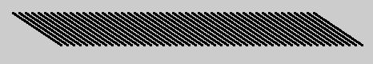
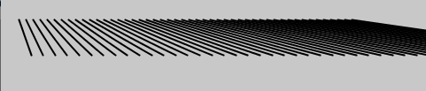
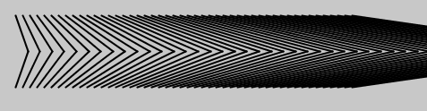

# Processing - Week 6

## Loops and lines

Let's revisit `for` loops, this time to draw sets of lines.

	void setup() {
		size(480, 480);
		strokeWeight(2);
	}

	void draw() {
		for (int i = 20; i < 400; i += 8) {
			line(i, 40, i + 60, 80);
		}
	}

### This loop 

- Uses a counter that starts at 20 `int i = 20;`
- Continues as long as the counter is under 400 `i < 400;`
- Increases by 8 after each loop `i+=8`

### The lines

The arguments for line are the co-ordinates of the two points/ends of the lines: `line(x1, y1, x2, y2)`

- The x1 value uses the counter value: `i`
- The y1 value stays constant at `40`
- The x2 value uses the counter value `+ 60`, so it is always 60 pixels to the right of `x1`.
- The y2 value stays constant at `80`, so 40 pixels lower than where the line started

So we get this

## Fanning the lines

Now your goal is to fan the lines out, so they aren't all parallel, like this:

Some hints:

- There are four arguments to `line()` only one of them has actually changed.
- It will need to increase by an amount that *increases* for each loop e.g.
	- If it were 10 on the first loop
	- It would be 15 on the second loop (difference of 5)
	- And then 22 on the third loop (difference of 7)
- To achieve this try multiplying the number instead of adding to it (start at 2 and work from there)

## Kinking the lines

Now add a kink to the lines to achieve this:

You actually achieve this by drawing a second line, but what should the arguments be?

## Making the lines your own

Now alter the sketch, and use the [processing reference](http://processingjs.org/reference/) to make this sketch *your own*. 

Some ideas:

- Lines be different colours (a gradient would be easy to achieve)
- Lines connected to your mouse position
- Lines change colours when you move the mouse over them
- Different thicknesses of lines

### Other student's examples:

#### Naail - Mouse changes colour

<iframe id='ifr' width='480' height='515' scrolling='no' style='background: url(http://clsb.processingtogether.com/static/img/jun09/pad/connectingbar.gif) no-repeat center 60px;' src='http://clsb.processingtogether.com/sp/pad/iframe/ro.9mwwbtBM2n2eja/rev.463?autostart=0'></iframe>

#### G-Man - Lines follow mouse

<iframe id='ifr' width='480' height='335' scrolling='no' style='background: url(http://clsb.processingtogether.com/static/img/jun09/pad/connectingbar.gif) no-repeat center 60px;' src='http://clsb.processingtogether.com/sp/pad/iframe/ro.9f6GiaNfwM2FEh/rev.163?autostart=0'></iframe>

#### Eesa - Pseudo Shadows

<iframe id='ifr' width='580' height='515' scrolling='no' style='background: url(http://clsb.processingtogether.com/static/img/jun09/pad/connectingbar.gif) no-repeat center 60px;' src='http://clsb.processingtogether.com/sp/pad/iframe/ro.9nWX-TvIM3r8N6/rev.408?autostart=0'></iframe>